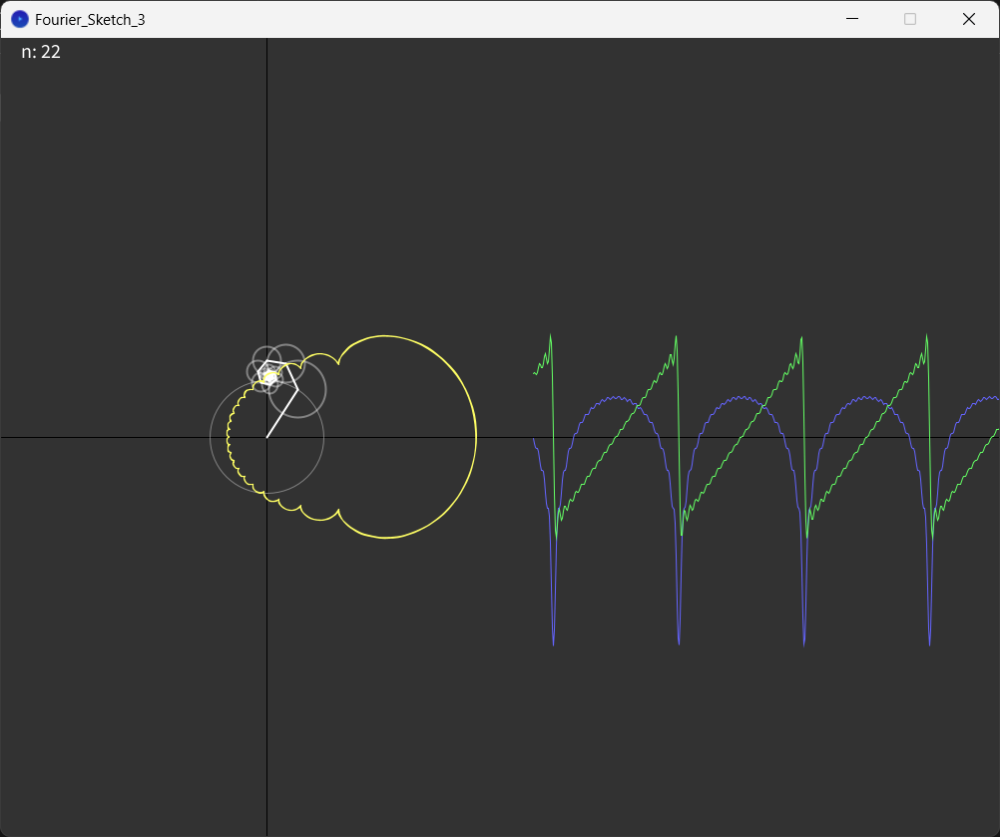

# FourierSketch
A simple java processing program visualizing fourier transform of triangle function

!ATTENTION: this code was written using Processing Java, go to the link below and download the program for running the program smoothly. I've uploaded uploaded a screenshot of the program to show the program
 <a href="processing.org">processing.org</a>

 
You can use the following keyboard buttons in the program:
  <ul>
<li>UP arrow : increase the Nth iteration of the fourier transform</li>
<li>DOWN arrow : decrease the Nth iteration of the fourier transform</li>
<li>RIGHT arrow : toggle the visual of the real part of the series</li>
<li>LEFT arrow : toggle the visual of the imaginary part of the series</li>
    </ul>

